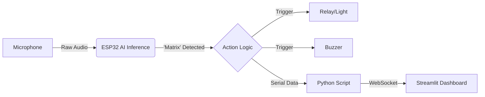

# 🪄 ESP32 Offline Voice AI & IoT Mission Control

A "Headless" Voice Artificial Intelligence system running entirely offline on an ESP32. It detects custom wake words using TinyML and communicates with a PC-based Python Dashboard for real-time telemetry and remote control.

---

## 🚀 Project Overview

This project demonstrates a **Full-Stack IoT Architecture**:
1.  **The Edge Device (ESP32):** Runs a quantized Neural Network (int8) to detect the wake word **"Matrix"** in real-time (90% accuracy).
2.  **The Backend (Serial Protocol):** A custom UART communication protocol syncs hardware state with the software.
3.  **The Frontend (Python Dashboard):** A Streamlit-based "Mission Control" that visualizes simulated environmental data and allows remote overrides of physical actuators.

**Why "Headless"?**
The system is designed to operate without a physical display on the device itself, relying instead on a robust serial link to a central dashboard, mimicking real-world industrial IoT setups.

---

| Voice Command | Dashboard Response |
| :---: | :---: |
| **"Matrix"** | ✅ Triggers Relay (Light ON) & Logs Event |

---

## 🛠️ Tech Stack

### **Hardware**
* **Microcontroller:** ESP32 (DOIT DEVKIT V1)
* **Audio Input:** MAX9814 Electret Microphone (Auto Gain Control)
* **Actuators:** 5V Relay Module, Piezo Buzzer
* **Feedback:** Onboard LED (GPIO 2) status indicators

### **Software & AI**
* **Firmware:** C++ (Arduino Framework)
* **Machine Learning:** Edge Impulse (MFCC Feature Extraction + Keras Neural Network)
* **Dashboard:** Python, Streamlit, PySerial, Pandas
* **Protocol:** Custom UART Serial JSON-like packets

---

## 🧠 The AI Model

The core of this project is a TinyML model trained to distinguish between:
* `Matrix` (Wake Word)
* `Noise` (Background sounds)
* `Stop` (Secondary command)

**Model Stats:**
* **Input:** 1-second audio window (16kHz sampling)
* **Processing:** MFCC (Mel-frequency cepstral coefficients)
* **Architecture:** Convolutional Neural Network (CNN)
* **Inference Time:** ~30ms on ESP32
* **Accuracy:** 90.0% (Validation Set)

---

## 🔌 Architecture Data Flow

💻 How to Run
1. Firmware (ESP32)
Install the Edge Impulse Arduino Library (included in lib/).

Open firmware/firmware.ino.
Upload to ESP32.

2. Dashboard (Python)
Ensure the ESP32 is connected via USB.

# Install dependencies
pip install streamlit pyserial pandas

# Run the Mission Control
streamlit run dashboard/app.py

🔮 Future Improvements
Implement MQTT for wireless control instead of USB Serial.
Add hardware sensors (DHT22) for real environmental data (currently simulated for dashboard demo).
Expand vocabulary to include "Turn Off" and "Report Status".

Author
Ojas Vaidya
Electronics & Communication Engineering Student IIITDM Kancheepuram
